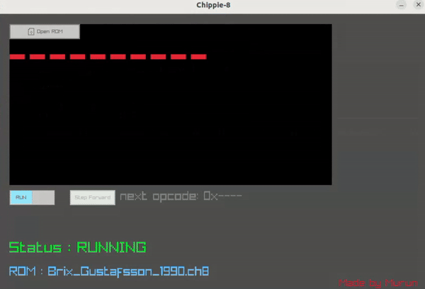

# Purpose
This project recreates a popular fantasy-console from the 1970s: Chip-8. Using C++17, raylib, and raygui, Chippie can load, run, and pause ROM execution. Give it a try!



# Prerequisites
* Install [spdlog as a lib](https://github.com/gabime/spdlog?tab=readme-ov-file#compiled-version-recommended---much-faster-compile-times)
* Install [raylib as a lib](https://github.com/raysan5/raylib/wiki/Working-on-GNU-Linux#build-raylib-using-cmake)
* Needs: cmake, make, clang++
    * ```sudo apt install cmake, make, clang++```

# Building
1. ``` git clone https://github.com/moomurrs/chippie-8.git ``` 
2. ``` cd chippie-8 ``` 
3. ``` mkdir build && cd build ``` 
4. ``` cmake .. ``` 
5. ``` make ``` 
6. ``` ./chippie ``` 
